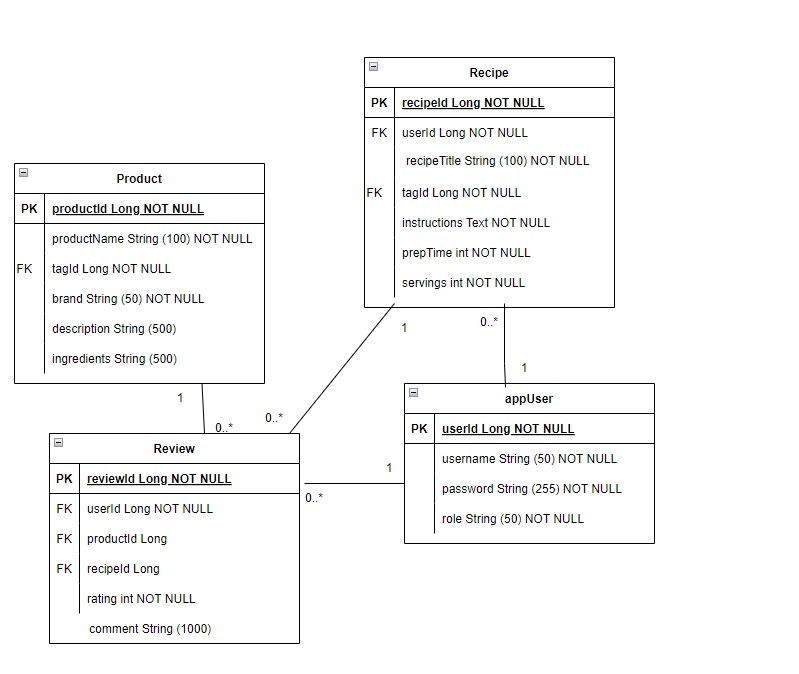

# Vegit - sovellus kasvisruoan ystäville

## Johdanto
Vegit on kasvisruokatuotteisiin ja resepteihin keskittyvä sovellus, jossa käyttäjät voivat jakaa kokemuksiaan ja löytää inspiraatiota terveelliseen ja ekologiseen ruokailuun. Sovelluksen avulla voi tutustua laajaan vegaanisiin tuotteisiin, lukea muiden käyttäjien arvosteluja ja lisätä omia tuotteisiin liittyviä kokemuksia.

Vegit tarjoaa myös mahdollisuuden lisätä reseptejä, joissa hyödynnetään kasvipohjaisia tuotteita sekä ja antaa niistä palautetta. Reseptit auttavat käyttäjiä kokeilemaan uusia raaka-aineita sekä löytämään uusia tapoja nauttia kasvisruuasta. 

## Luokkakaavio
Tämä luokkakaavio havainnollistaa sovelluksen rakennetta.

## Tietohakemisto

> ### _appUser_
> _appUser-taulu sisältää käyttäjätilin tiedot. Tili kuuluu aina vain yhdelle käyttäjälle._

> Kenttä | Tyyppi | Kuvaus
> ------ | ------ | ------
> userId | Long PK | Käyttäjän yksilöivä tunniste
> roleId | Long FK | Roolin tunniste (viittaus role-tauluun)
> username | String (50) |  Käyttäjän käyttäjätunnus
> password | String (250) | Käyttäjän salasana

> ### _Role_
> _Role-taulu sisältää erilaisten käyttäjäroolien tiedot. Rooleja voidaan käyttää auktorisointiin_

> Kenttä | Tyyppi | Kuvaus
> ------ | ------ | ------
> roleId | Long PK | Roolin yksilöivä tunniste
> roleName | String (50) | Roolin nimi, esim. "admin" tai "user"

> ### _Product_
> _product-taulu sisältää tuotteen tiedot. _

> Kenttä | Tyyppi | Kuvaus
> ------ | ------ | ------
> productId | Long PK | Tuotteen yksilöivä tunniste
> tagId | Long FK | Kategorian indikaattori, viittaus tag-tauluun
> productName | String (100) | Tuotteen nimi, esimerkiksi "Soijasuikaleet" tai "Nyhtökaura"
> brand | String (50) | Tuotemerkki, esimerkiksi "Vegesun" tai "Gold & Green"
> description | String (50) |  Tuotteen tarkempi kuvaus
> ingredients | String (500) | Tuotteen ainesosat

> ### _Recipe_
> _recipe-taulu sisältää reseptin tiedot. _

> Kenttä | Tyyppi | Kuvaus
> ------ | ------ | ------
> recipeId | Long PK | Reseptin yksilöivä tunniste
> tagId | Long FK | Kategorian indikaattori, viittaus tag-tauluun
> recipeTitle | String (100) | Reseptin otsikko
> instructions | Text | Tarkemmat ohjeet
> prepTime | int |  Valmistukseen kuluva aika
> servings | int | Tieto siitä, kuinka monelle syöjälle reseptistä riittää

> ### Tag_
> _tag-taulu sisältää sekä tuotteisiin että resepteihin liitettävän kategoriaunnisteen. _

> Kenttä | Tyyppi | Kuvaus
> ------ | ------ | ------
> tagId | Long PK | Kategorian tunniste
> tagName | String (50) | Kategorian nimi, esimerkiksi "Vegaaninen" tai "Gluteeniton"

